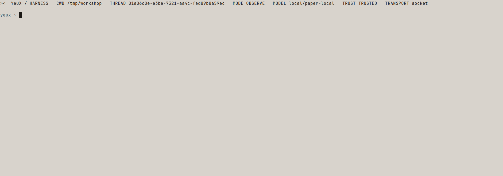
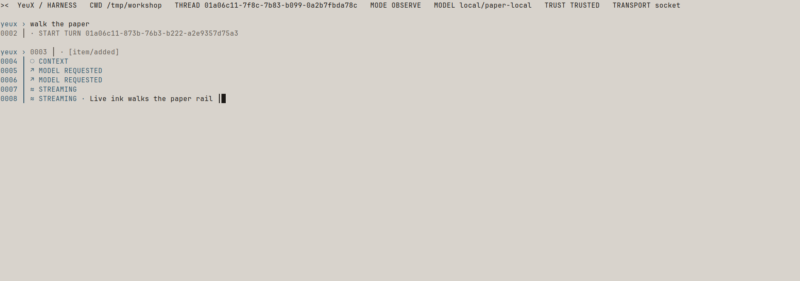
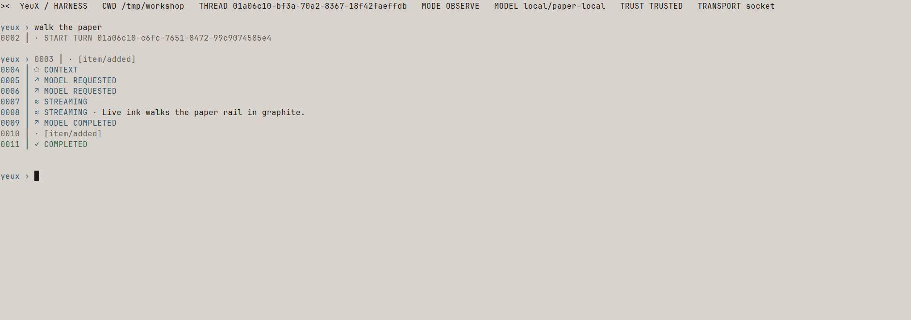
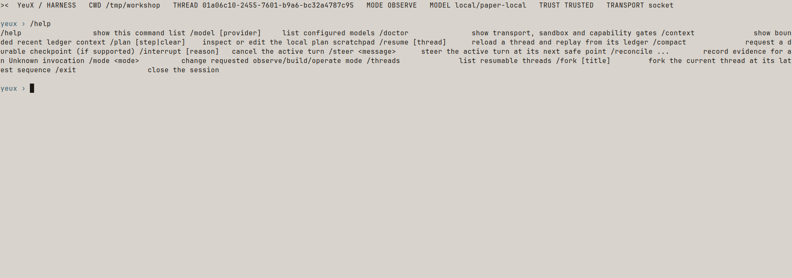
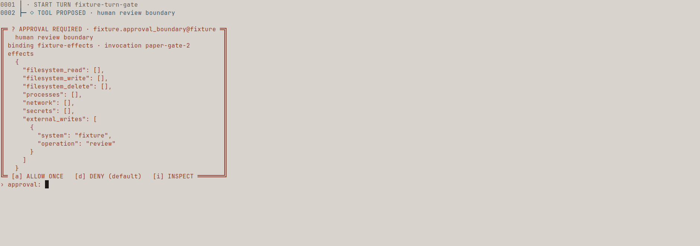
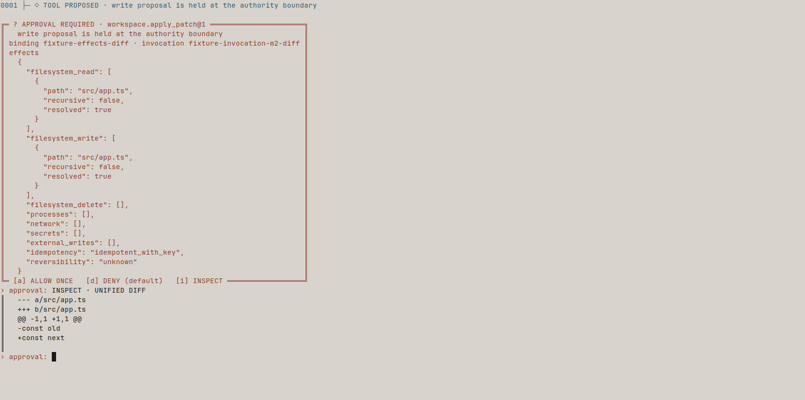
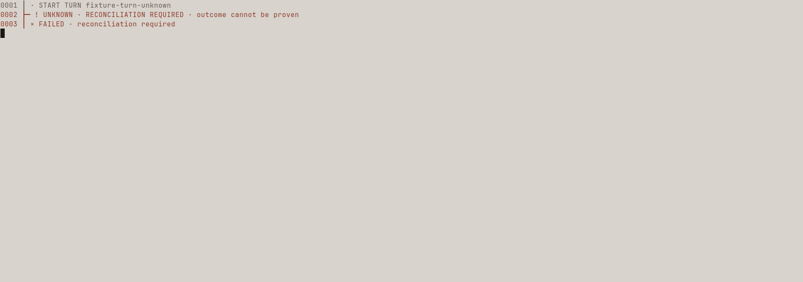
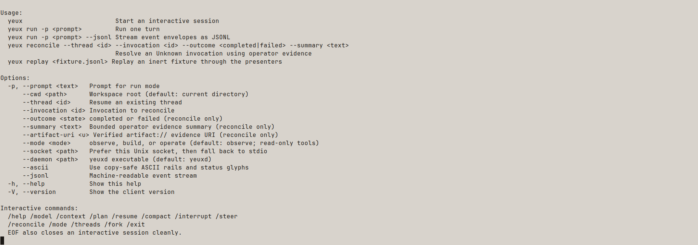

# YeuX Harness

> 安全、可重放、可解释的本地混合智能体平台。
>
> 纸本工作台，仪器只取密度。

<p align="center">
  
</p>

YeuX Harness 面向个人高级用户，采用 Rust 权威运行时和 TypeScript 终端界面。它将模型输出、仓库内容、工具、MCP 与插件都视为不可信输入，并用事件账本、能力交集、精确审批和操作系统沙箱约束副作用。

项目采用 Apache-2.0 许可证，首发目标平台为 macOS 和 Linux。

**当前版本是 `v0.1.0-alpha.1` Developer Preview。** 产品面是 TypeScript 终端客户端 `yeux`（`0.1.0-alpha.1`）通过 Unix socket / stdio 连接 Rust daemon `yeuxd`（`0.1.0-alpha.1`）。默认主题是 Paper（`#D8D3CC` 纸面、`#8C3A2C` 朱印、`#2A2733` 夜墨）。打开会话后的默认纸面是安静的：只画 Session Bar、按 `seq` 排列的时间轨，以及 `yeux ›`。`/mode` 之后 Session Bar 必须跟着有效权限刷新——`OBSERVE` 不得继续广告 `MODE BUILD`。活的 `model/event` `text_delta` 会以打字机走上纸面（拉丁 18ms、CJK 24ms、单段最多 600ms，石墨插入符 `│`）。朱红 Approval Gate 默认 DENY，`[i]` 才打开 Inspector / unified diff。

下面的截图来自 Linux 上真实运行的 `yeux` + `yeuxd`（main 在 PR #7 / `7ef4bd8d` 之后），以及 in-tree presenter fixtures；不是效果图。打字机与模型行走的是本机 OpenAI-compatible provider，不是伪造 TUI。审批门、inspect diff 和 unknown→failed 时间轨来自 `yeux replay` 的 inert fixture（不启动 provider、不写仓库）。普通 TTY 不嵌入鱼仔位图；本仓库的品牌回退是 [`assets/brand/yeux-fish-doodle-fallback.svg`](assets/brand/yeux-fish-doodle-fallback.svg)。设计说明见 [设计系统 / Paper Signal](docs/design/README.md)。

## 产品界面

### Quiet default

配置了 provider 之后，`yeux` 连上 `yeuxd` 只画 Session Bar（`CWD` / `THREAD` / `MODE` / `MODEL`，以及 trust 与 transport）和 `yeux ›`。默认 mode 是 `OBSERVE`。纸面上没有 Inspector。



### `/mode` 刷新 Session Bar

`/mode build` 在 sandbox、write tools 和 workspace trust 都就绪时，把有效 mode 收成 `build`，并立刻重画 Session Bar。`/mode observe` 必须把 Bar 收回到 `MODE OBSERVE`，不能留下上一轮的 `MODE BUILD`。


### 活墨打字机

现场 `text_delta` 沿时间轨走字，插入符是静止的石墨 `│`。这一张拍在墨迹走到一半时。



走完之后仍是安静纸面：完整模型行、回合 `COMPLETED`，然后回到 `yeux ›`。Inspector 仍然不出现。



### `/help` 与 `/doctor`

交互命令是确定性路由，不会被当成模型提示。`/help` 列出 `/model` `/doctor` `/context` `/plan` `/resume` `/compact` `/interrupt` `/steer` `/reconcile` `/mode` `/threads` `/fork` `/exit`。`/doctor` 打印 transport、sandbox、host ceiling 和 write/process 工具是否广告。




### 朱红 Approval Gate

朱印门来自 presenter fixture replay：`yeux replay packages/tui/fixtures/paper-approval-gate.jsonl` 把 `tool/proposed` 送进双线审批框，默认 DENY。Replay 立即倒完，没有打字机。真实 daemon 的 `approval/request` 走同一套门框。



`[i]` 打开 `INSPECT · UNIFIED DIFF`（或规范化参数）。关闭的门框保持关闭。这一张来自 `paper-m2-apply-diff.jsonl`。



### Replay 时间轨

`packages/tui/fixtures/paper-unknown-failed.jsonl` 是一条 inert 事件流（不启动 daemon、不调用 provider）：`UNKNOWN · RECONCILIATION REQUIRED` 会留在轨上，随后 Turn 以 `FAILED` 收束。



### 命令行帮助

`yeux --help` 列出交互会话、`run`、`reconcile`、`replay` 与 `--mode` / `--ascii`。客户端版本是 `0.1.0-alpha.1`。



## 当前状态

**当前版本是 `v0.1.0-alpha.1` Developer Preview：只读 Agent loop、首版受保护写入/进程管线和一个 M2.5 真实仓库纵向 fixture 已贯通。该版本是源码预发布，尚未完成稳定 v0.1 的全部发布门槛。**

当前代码已经提供：

- 四个 Rust crate：`yeux-protocol`、`yeux-core`、`yeux-runtime`、`yeuxd`。
- JSON-RPC 2.0 类型、UUIDv7 命令标识、Thread 内单调事件序列和协议版本协商。
- 从 Rust 类型生成并提交的 56 份稳定 JSON Schema，以及字节级 drift test。
- SQLite WAL 追加式事件账本、禁止更新/删除的数据库触发器，以及纯事件投影 replay。
- `Workspace -> Thread -> Turn -> Item` 投影、单 Thread 单 active Turn 约束、按 `parent_seq` 继承上下文的 fork、steer 控制事件持久化、interrupt 执行控制和按 `afterSeq` 补发。
- stdio 与 Unix socket daemon 传输；客户端默认探测 `$XDG_RUNTIME_DIR/yeux/yeuxd.sock`，否则使用 `${os.tmpdir()}/yeux-<uid>/yeuxd.sock`（Linux 通常为 `/tmp/yeux-<uid>/yeuxd.sock`）。socket 父目录和节点必须由当前 UID 所有且仅 owner 可访问，客户端在连接前后核对类型及 device/inode。
- OpenAI-compatible 流式 provider 与有界多轮 Agent loop。Provider 声明支持 tool calls 时，daemon 至少注册 `workspace.list`、`workspace.read`、`workspace.search`；sandbox 就绪且 host ceiling 非 `observe` 时，再按统一 authority path 广告 `workspace.apply_patch`、`process.run`。模型可调用已广告工具、接收结果并继续推理。Tool-call JSON 分片、调用数/参数/结果预算、累计输出和 provider 流均有硬上限；`workspace.search` 另受每 Turn 共享的 matcher operation budget（由 32 MiB 扫描上限推导、配置只能收紧）、同一 canonical workspace identity 的单槽 gate，以及 daemon 级 4 槽 blocking-worker 上限约束。
- 受 revision 保护的工作区读写原语、内容寻址 artifact store、能力策略和 macOS/Linux 沙箱封装原语。三个只读工具具有严格 JSON 参数、稳定输出顺序、workspace 路径与链接防护，并记录解析后的实际读取 effect；Unix mutation 进一步绑定 root dirfd 和逐组件 no-follow 打开。
- `yeuxd::InvocationPipeline` 已接入隐藏的 `workspace.apply_patch` 与 `process.run` adapter：副作用必须经过 capability 交集、沙箱检查、daemon 授权、一次性 prepared token、审批绑定、执行前重验证和 opaque permit；沙箱不可用时失败关闭。TUI 已提供 deny-default 的审批框、inspect unified diff 和 `approval/request` 响应。
- M2.5 最小闭环 fixture 使用临时 Git 仓库和脚本 provider，验证 `read → 公开 plan → revision-bound patch → 5 次副作用审批 → check 失败 → 按新 revision 修复 → check 通过 → final Git diff`，并从 ledger 断言 ToolCall/ToolResult、EffectSet、退出码和终态。完整 process 链只在 Linux strict sandbox 能力通过时运行；当前 macOS 继续明确关闭任意进程。
- `workspace.apply_patch` 通过 sandbox capability gate、policy/approval 和受限 descriptor-bound writer 发布并校验新 revision；它不启动任意子进程。Unix 路径使用 root dirfd、逐组件 `openat(O_NOFOLLOW)`、`O_EXCL` 临时文件和 `renameat`，但 POSIX 最终名称仍没有 inode/hash 条件 CAS。`process.run` 强制绝对可执行文件、workspace 内 cwd、无网络和异步 `ProcessExecutor`，并要求 sandbox capability probe/handshake；这些能力只有在 sandbox 就绪且 host ceiling 非 `observe` 时才会向 provider 广告。
- `CredentialBroker` 与 provider 的 opaque credential source 已实现为 runtime/pipeline 注入 seam；嵌入式 daemon 可提供 broker，独立 CLI 当前使用 `NoCredentialBroker`，未解析 handle 会失败关闭。操作系统 keychain/企业 secret store 尚未接入。
- TypeScript 协议包和进程外 plugin host 基线；人类终端上的模型/诊断/交互文本会移除 ANSI/OSC、C0/C1 和双向文本控制字符，`--jsonl` 则保留原始协议 payload。插件可执行文件需要摘要校验，能力只能从 manifest 请求集合中收紧。
- 行式 TUI 已有确定性的 `/help`、`/model`、`/doctor`、`/context`、`/plan`、`/resume`、`/compact`、`/interrupt`、`/steer`、`/reconcile`、`/mode`、`/threads`、`/fork` 和 `/exit` 路由；运行中 Turn 可接收 steer/interrupt，审批会抢占空闲命令提示，EOF 正常退出。requested/effective mode、workspace trust、host ceiling、sandbox 和工具不可用原因保持可见。
- 可执行 lifecycle golden trace，覆盖订阅补发、Turn 中断、replay 和 daemon 重启后的命令去重。

当前 Agent loop 与副作用管线的边界如下：

- `turn/start` 会在持久化 Turn 和用户消息后启动后台 runner；配置 `--provider-base-url` 和 `--model` 时，可完成 `provider -> read-only tools -> provider -> answer` 的多轮任务。流式模型事件、ToolCall/ToolResult Item、Invocation 状态和 Turn 终态均进入 ledger。未配置 provider 时，Turn 以 `provider_unconfigured` 诊断进入 `failed`。
- 同一模型轮次内的多个只读调用会并发执行（同一 canonical workspace identity 的 `search` 默认串行），但结果严格按模型首次给出的调用顺序持久化并回灌。Invocation 当前经历 `proposed -> approved -> prepared -> started -> completed/failed/cancelled/unknown`；`unknown` 表示停止或外部结果无法证明，必须先 reconciliation，未注册工具只形成错误结果，不会被分派为 Shell、写文件或网络操作。
- runner 在每次后续 provider 请求前从 ledger 重新加载上下文，因此已持久化的 `turn/steer` 会在下一模型请求安全点进入当前 loop。取消后不再提交残余 provider delta；若工具已跨越执行边界但无法证明停止，会记录有界 Unknown 诊断并将 Turn 以 reconciliation-required 的 `failed` 收束，而不是伪装成 clean `cancelled`；daemon 重启会把未终结 Turn 记录为 `failed`，不会自动重放外部工作。
- 默认 Turn 上限为 8 个模型轮次、32 个工具调用、4 MiB 累计工具结果和一个共享 search operation budget（不超过一次 32 MiB 扫描的 matcher 工作量；CLI 只能收紧）。单个只读调用还受 10,000 个遍历项、32 层深度、1 MiB 单文件、32 MiB 总扫描、1,000 个匹配和 8 MiB JSON 输出限制。
- 写文件、补丁和进程原语已经接入 daemon 的统一 policy/approval/sandbox 管线。文件 prepare→execute 的路径重定向竞态已由 dirfd/逐组件 no-follow/父目录重检关闭，但 POSIX 最终名称的 hostile-writer 条件发布仍无法由 `renameat` 消除；进程 backend detection probe、执行前 handshake、严格能力门禁和 Linux PID namespace 已接入，macOS 任意进程保持关闭。`invocation/reconcile` 已提供 evidence-only、幂等收束（不重试 provider/tool）。本轮已增加最小 wire mutation 与 capability-gated Git fixture；10 仓库任务套件、专用 Git/checkpoint 工具、网络 endpoint 代理、artifact 输出/GC 和跨平台 supervisor 仍未完成。
- `thread/compact` 和 `job/run` 明确返回“功能不可用”；Job 目前只有规格与状态管理。
- Anthropic、Gemini、OpenAI Responses、Skills、MCP 执行、FTS 记忆、定时任务和 worktree 子智能体仍在路线图中；交互 TUI 与无头 JSONL 的完整投影一致性测试、artifact 证据关联和随机崩溃注入矩阵也尚未完成。
- 当前 plugin host 有独立进程、最小环境和摘要校验，但还没有接入 Rust 策略内核与 OS 沙箱，因此不应运行不受信任插件。
- TypeScript `RuntimeCommandMap` 已覆盖当前稳定 daemon 命令面；类型仍由人工与已提交 JSON Schema 同步，从 Rust schema 自动生成并建立完整跨语言 drift gate 仍需完成。

因此，当前适合协议、运行时和受控 mutation 开发，以及有边界的仓库闭环实验；在最终名称 CAS/hostile-writer 证据、跨平台进程树监督、artifact/reconciliation UX 和多仓库真实任务 gate 通过前，不应作为无监督自主编码工具使用。

## 核心承诺

### 安全

所有副作用最终都必须经过同一条管线：

```text
validate -> prepare effects -> policy intersection -> approval
         -> OS sandbox -> execute -> redact/normalize -> persist result
```

有效能力只能缩小：

```text
host ceiling ∩ user profile ∩ project trust ∩ turn override
```

目标状态下，`observe` 必须是执行层保证的只读模式；`build` 允许可信工作区内的受限写入和进程；`operate` 才能请求外部写操作。审批不能突破 host ceiling，子智能体也不能提权。当前三个内置只读工具以及首版 mutation/process adapter 都经过严格参数校验、effect 绑定、持久化调用状态和资源上限约束；网络 endpoint 策略、最终名称条件 CAS、跨平台进程 supervisor 和完整 artifact/reconciliation UX 仍保持关闭或受限。

### 可重放

SQLite 中的追加事件是会话事实源。Replay 只读取历史事件并重建相同投影，**绝不会自动重新调用模型、工具、网络或外部系统**。未知状态的非幂等操作只能进入 reconciliation，不能自动重试。

### 可解释

事件携带 schema version、UUIDv7 `event_id`、Thread 内单调 `seq` 和 `causation_id`。当前只读与首版副作用调用均记录 ToolCall/ToolResult、Invocation 状态和解析后的 effect；目标状态下，每次工具调用还必须完整说明工具版本、权限来源、审批摘要、沙箱证据和执行结果。

## 进程拓扑

```text
yeux (TypeScript terminal client)
   |  JSON-RPC 2.0 over private per-user Unix socket
   |  fallback: spawn `yeuxd --stdio`
   v
yeuxd (Rust authority)
   |- protocol dispatch and event subscriptions
   |- agent state machine and provider/tool ports
   |- policy, approval and sandbox boundary
   `- SQLite ledger and artifact store

third-party plugin
   ^
   `- restricted out-of-process plugin host (target architecture)
```

`yeuxd` 是数据库、模型、工具、沙箱和任务执行的唯一权威。TypeScript 客户端不得打开 SQLite，也不得直接执行工具。

## 仓库结构

```text
crates/
  yeux-protocol/   # I/O-free wire types、JSON Schema 源和稳定方法名
  yeux-core/       # 状态机、投影 replay、能力交集和执行端口
  yeux-runtime/    # SQLite、workspace、provider、process、sandbox、artifact
  yeuxd/           # stdio/Unix socket JSON-RPC daemon
packages/
  protocol/        # TypeScript JSON-RPC 客户端与当前协议类型
  tui/             # 协议专用终端客户端，发布目标命令名为 `yeux`
  plugin-host/     # 进程外插件宿主基线
docs/
  adr/             # 已接受架构决策
spec/traces/       # 黄金事件轨迹规范与后续 fixtures
spec/schema/       # 从 Rust 公共类型生成的稳定 JSON Schema
```

## 开发

环境要求：Rust 1.98、Node.js 22 或更高版本、pnpm 9.15.9。

```bash
cargo fmt --all --check
cargo clippy --workspace --all-targets -- -D warnings
cargo test --workspace --all-targets

pnpm install
pnpm typecheck
pnpm test
pnpm build
```

可以单独启动协议 daemon：

```bash
cargo run -p yeuxd -- --stdio --state-dir /tmp/yeux-dev
```

也可以先编译 daemon，再打开纸本 TUI。未配置 `--provider-base-url` 和 `--model` 时仍可进入交互会话，使用 `/help`、`/doctor` 和 `/mode`；普通提示会以 `provider_unconfigured` 失败，而不会假装有模型回复。

```bash
cargo build -p yeuxd
pnpm --filter @yeux/protocol build && pnpm --filter @yeux/tui build
pnpm --filter @yeux/tui start -- --daemon target/debug/yeuxd
```

stdio 与 Unix socket 都使用一行一个 JSON-RPC 消息的 UTF-8 JSON。当前终端客户端源码包名为 `@yeux/tui`，可执行命令名为 `yeux`；最终发行包会将它与匹配版本的 daemon 和 plugin host 一起打包，不依赖用户预装 Node/Bun。

## 文档

- [版本变更记录](CHANGELOG.md)
- [架构](docs/ARCHITECTURE.md)
- [协议](docs/PROTOCOL.md)
- [路线图](docs/ROADMAP.md)
- [Run 3 执行记录](docs/audits/2026-09-01-run-3/EXECUTION_LOG.md)
- [Run 4 当前状态、风险与执行计划](docs/audits/2026-09-03-run-4/STATUS_AND_PLAN.md)
- [竞争差距分析与 P0–P4 计划](docs/COMPETITIVE_GAP_ANALYSIS.md)
- [Run 5：2026-09-04 当前竞争差距分析](docs/audits/2026-09-04-run-5/COMPETITIVE_GAP_ANALYSIS.md)
- [Run 5：P0 / M2.5 纵向切片执行记录](docs/audits/2026-09-04-run-5/EXECUTION_LOG.md)
- [威胁模型](docs/THREAT_MODEL.md)
- [架构决策](docs/adr/)
- [设计系统 / Paper Signal](docs/design/README.md)：深色优先的 TUI/CLI/网页美学、Unicode/ASCII 资产和可选双鱼欢迎资产

## 设计来源

YeuX 是 clean-room 实现，吸收以下项目的公开设计经验：

| 来源 | 主要借鉴 | YeuX 的取舍 |
|---|---|---|
| [Grok Build@bc7f02e](https://github.com/xai-org/grok-build/tree/bc7f02eddd3d84085849dc19ed216f11c23b0571) | runtime/workspace/policy 分层、延迟 MCP、worktree 子任务 | 沙箱默认开启，安全 hooks 失败关闭 |
| [Codex@d58d0e5](https://github.com/openai/codex/tree/d58d0e5841e0de08e251673db2d5af8cf3a1ad51) | Thread/Turn/Item、app-server、审批与 OS 沙箱正交 | 保留小型模块化单体，不复制企业与云端复杂度 |
| [Pi@853a80d](https://github.com/earendil-works/pi/tree/853a80d26c90a14c1886f0ebb8ffaae133ca2185) | 小内核、供应商无关 API、steer、fork、确定顺序 | 增加强制沙箱、审批和权限继承 |
| [DeepSeek Harness@0a53fb5](https://github.com/deepseek-ai/deepseek-harness/tree/0a53fb55bea101816fa226bb964ae2bed71c343b) | capability seams、可撤销注册、append-only ledger | policy、ledger 与 UI 边界不可被插件替换 |
| [Hermes@66666f6](https://github.com/NousResearch/hermes-agent/tree/66666f6e2eca0ae883195a34c66131985ea7dd06) | FTS 搜索、策展记忆、Skills、本地任务 | v1 不复制大单体与全消息网关 |

若后续复制 MIT/Apache 许可代码，必须保留原许可并更新 `THIRD_PARTY_NOTICES.md`。

## v1 边界

v1 不包含 Windows、远程/云沙箱、消息平台、语音、企业控制面、插件市场、Python SDK、ACP、向量记忆或子智能体自动合并。

详细交付顺序与发布门槛见 [ROADMAP](docs/ROADMAP.md)。
